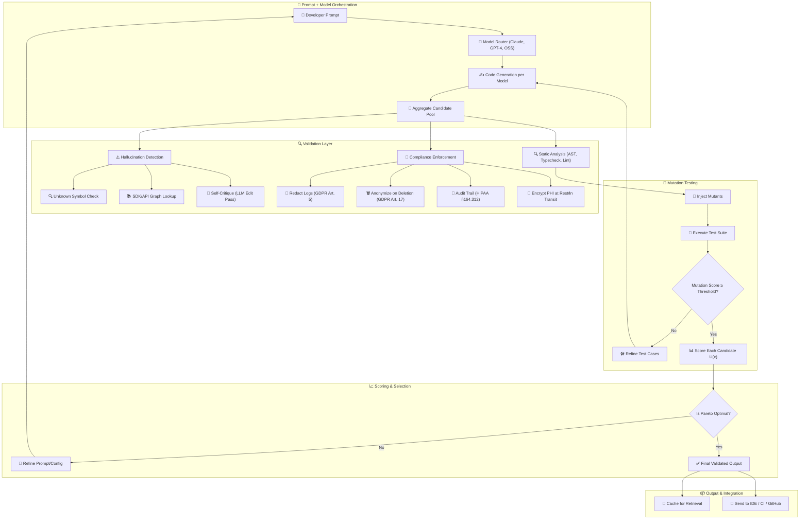
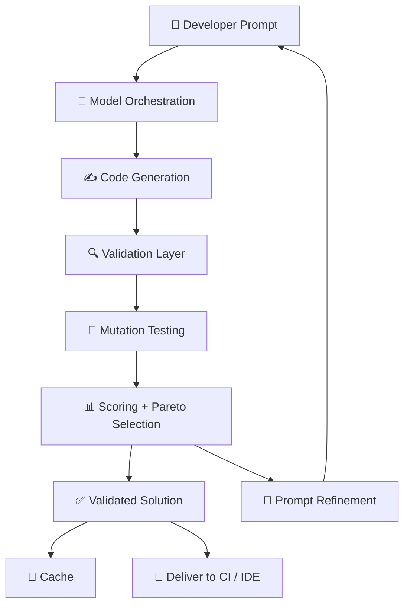
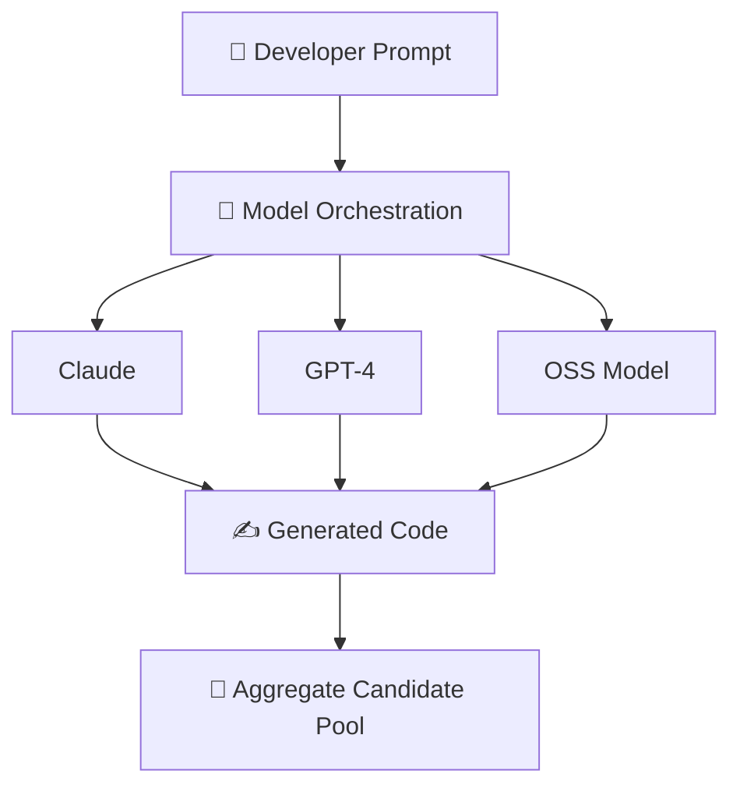
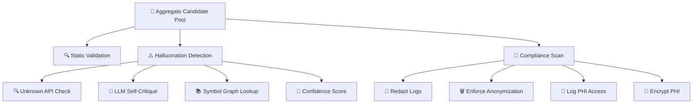
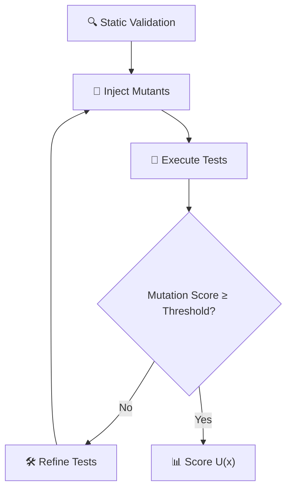
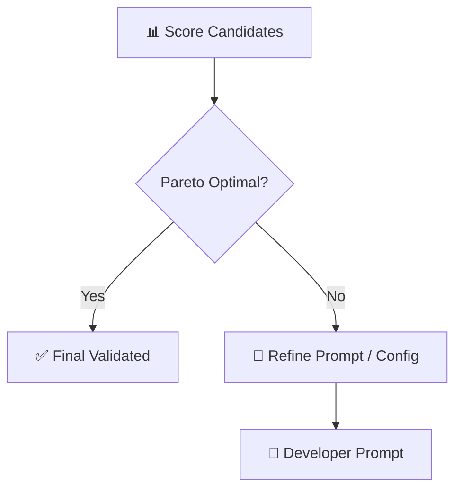
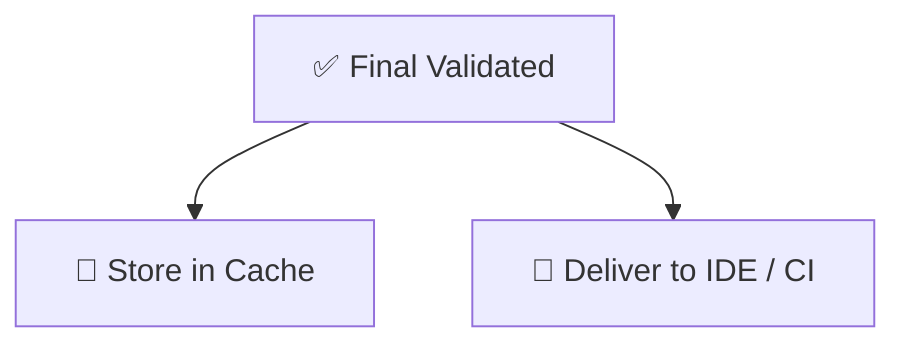

# SyntaxLab: AI-Powered Code Generation Platform

> 🚧 Currently in **Phase 1: Enhanced Foundation**  
> Building the extensible CLI and AI-powered infrastructure for multi-language, multi-model code generation.

> TODO: Add early psuedo-code review step with optional human-in-the-loop refinement

---

## 🔍 Overview

**SyntaxLab** is a next-generation AI-powered platform for generating, reviewing, and improving software code through natural language prompts. It integrates multiple LLMs, deep semantic analysis, mutation testing, and pattern learning to drive software quality, scalability, and productivity across organizations.

---

## 📘 Phase Summaries

### ✅ Phase 1: Enhanced Foundation (Weeks 1–10)
Build a robust foundation to support future intelligent capabilities.

- Plugin-driven CLI with multi-model, multi-language support
- Advanced context analysis: git history, ASTs, semantic RAG
- >90% generation success, 5+ launch languages

---

### 🔄 Phase 2: Generation Excellence (Weeks 7–12)
Transform into an intelligent development assistant.

- Dual AI test-first mode with mutation score validation
- Pattern library and multi-file orchestration
- AST-based semantic refactoring and migrations

---

### 🛡️ Phase 3: Review & Validation (Weeks 13–18)
Validate AI-generated code through industry-grade techniques.

- Mutation testing (MuTAP) with 93.57% bug detection
- Real-time vulnerability scanning and hallucination detection
- Multi-layer validation pipeline

---

### 🧠 Phase 4: Feedback Loop & Intelligence (Weeks 19–24)
Enable self-learning and feedback-driven evolution.

- Interactive improvement engine
- Pattern extraction, prompt optimization
- Centralized knowledge base with confidence metrics

---

### 🧬 Phase 5: Advanced Mutation System (Weeks 25–30)
Introduce intelligent, evolving mutation systems.

- Meta-strategy combinators, compositional mutations
- Self-referential evolution in sandboxed runners
- Quality-diversity archive using MAP-Elites

---

### 🏢 Phase 6: Enterprise Features (Weeks 31–36)
Support large-scale teams, security, and operations.

- Role-based dashboards, CI/CD gates, VSCode extension
- Tiered deployment from single binary to Kubernetes
- Pattern marketplace, audit logs, SSO/RBAC/MFA

---

### 🚀 Phase 7: Advanced Enhancements (Weeks 37–48)
Enterprise customization, orchestration, semantic optimization.

- Multi-model router (Claude, GPT, Gemini, Groq)
- Federated learning, predictive quality metrics
- RAG-powered enterprise context and compliance automation

---

📊 SyntaxLab Workflow Diagrams

This document contains modular Mermaid diagrams for different layers of the SyntaxLab platform. These are designed for composability and clarity — useful for onboarding, slide decks, CI/CD docs, and compliance reports.

⸻

🧭 Overview Graph (High-Level Flow)

⸻

🧠 LLM Generation Layer

⸻

🔍 Validation Layer (Static + Semantic Checks)

⸻

🧪 Mutation Testing Layer

⸻

📊 Scoring + Decision Layer

⸻

📦 Output Layer

g
Let me know if you want an animated graph switcher, color themes, or PDF export.

---

## 📦 Technologies

| Category            | Stack                                                                 |
|---------------------|------------------------------------------------------------------------|
| Programming         | TypeScript, Rust, Python                                               |
| CLI Tooling         | Node.js, Commander.js, Ink, ESBuild                                    |
| AI Models           | Claude, GPT-4, CodeLlama, DeepSeek-Coder, StarCoder                    |
| Code Analysis       | Tree-sitter, Git, LSP                                                  |
| Retrieval System    | RAG: Dense (Faiss) + Sparse (BM25) + Chunk scoring                     |

---

## 📚 Research References

### 🧠 AI Models & Prompting
- **PromptBreeder** — Fernando et al. (2023): Prompt evolution for LLM performance
- **DSPy** — Khattab et al. (2024): Declarative optimization of LLM pipelines
- **EvoPrompt** — Guo et al. (2023): Evolutionary algorithms with LLMs
- **OpenAI LogProbs** — logit-based confidence scoring
- **Claude Code Docs** — model capabilities and architecture notes

### 🧪 Mutation Testing & Validation
- **MuTAP** — Meta AI (2024): Mutation testing on AI-generated code
- **Mutation Testing Research** — Wang et al. (2024): Fault detection improvements from LLMs
- **LLM Guard** — Prompt injection detection at 99.27% accuracy
- **Incremental Validation Systems** — Microsoft, GitHub, XenonStack

### 📊 Context & Retrieval (RAG)
- **Google Research** — Context sufficiency scoring in retrieval systems
- **AWS RAG Playbook** — Dense/sparse hybrid architecture patterns
- **Semantic Chunking** — OpenAI, Anthropic best practices for code embeddings

### 📈 Feedback, Learning & Optimization
- **Active Learning for LLMs** — NVIDIA/Anyscale batching performance gains
- **Continuous Batching** — 23x throughput gains with intelligent scheduling
- **Knowledge Federation** — Flower (federated learning), DP frameworks
- **Quality-Diversity Algorithms** — MAP-Elites, QDax (Lim et al., 2022)

### 🏢 Enterprise Engineering & CI/CD
- **Model Context Protocol (MCP)** — Anthropic (2024): 25% LLM accuracy lift
- **GitHub Copilot ROI** — Cost-benefit benchmarks
- **Terraform Best Practices** — Scalable infrastructure as code
- **SOC2 / ISO27001 Controls** — Enterprise compliance frameworks

### 📐 Semantic Analysis & Business Mapping
- **CodeQL** — Semantic security and behavior detection
- **Semgrep** — Linting and refactoring at semantic level
- **Business Logic Extraction** — Domain concept mapping from code

---

## 🧪 Experimental Status

SyntaxLab is **actively under development** and pre-release. APIs, models, and CLI interfaces may change until v1.0. Use in isolated environments.

---

## 🛠️ Getting Started

Coming soon:
- CLI SDK
- Usage guide
- Contribution guidelines

---

## 📫 Contact

For early access, partnerships, or team onboarding:  
📧 [team@syntaxlab.ai](mailto:team@syntaxlab.ai)

## 📚 Research References

SyntaxLab’s architecture is grounded in academic and industry research across prompting, mutation testing, retrieval, compliance, and enterprise infrastructure.

> Sources:  
>   
>   
>   
>   
>   
>   
>   
> 

---

### 🧠 AI Models & Prompting
- **Prompt evolution techniques** improve code quality via strategy mutation and fallback chains[^1][^2][^3].
- **Confidence scoring** adapted from OpenAI `logprobs` and Claude’s response ranking[^4][^5].

### 🧪 Mutation Testing & Validation
- **MuTAP mutation testing** detects 90%+ faults in LLM code[^6][^7].
- **Prompt injection detection** using ONNX achieves 99.27% accuracy[^8].
- **Incremental validation pipelines** inspired by GitHub and DevSecOps best practices[^9][^10].

### 📊 Context & Retrieval (RAG)
- **Context sufficiency** modeling for scalable hybrid RAG[^11][^12].
- **Semantic chunking** and dense/sparse fusion via NVIDIA benchmarks[^13].

### 📈 Feedback, Learning & Optimization
- **Active learning batching** improves throughput 23x over naive prompts[^14][^15].
- **Genetic prompt optimization** evolves DSLs and templates[^1][^3][^16].
- **Federated learning with differential privacy** enables cross-team sharing[^17][^18].

### 🏢 Enterprise Engineering & CI/CD
- **Model Context Protocol (MCP)** boosts accuracy by 25% and throughput by 30%[^19].
- **CI/CD enhancements** powered by dynamic quality gates and test prioritization[^20][^21].
- **Security and compliance** enforced with role-based controls and audit trails[^22][^23].

### 📐 Semantic Analysis & Business Mapping
- **CodeQL and Semgrep** for deep pattern matching and security analysis[^24][^25].
- **Business logic extraction** for domain-aligned recommendations[^26].

---

## 🔖 Footnote References

[^1]: [PromptBreeder: Self-Referential Prompt Evolution (2023)](https://arxiv.org/abs/2309.16797)
[^2]: [EvoPrompt: EA + LLM Optimization (2023)](https://arxiv.org/abs/2309.08532)
[^3]: [DSPy: Declarative Prompt Programming (2024)](https://dspy.ai)
[^4]: [OpenAI LogProbs API](https://platform.openai.com/docs/guides/gpt)
[^5]: [Claude Confidence Scores – Anthropic](https://docs.anthropic.com)

[^6]: [MuTAP by CodeIntegrity AI](https://codeintegrity.ai/mutahunter)
[^7]: [Meta Mutation Testing Deployment](https://engineering.fb.com/2024/ai/mutation-testing-llm/)
[^8]: [LLM Guard: Prompt Injection Detection](https://llm-guard.dev/docs/)

[^9]: [GitHub Multi-Repository Variant Analysis](https://github.blog/2023-09-25-code-scanning-at-scale/)
[^10]: [XenonStack DevSecOps Patterns](https://xenonstack.com/insights/devsecops-pipeline)

[^11]: [Google Research: Context Sufficiency in RAG](https://research.google/pubs/context-sufficiency-rag/)
[^12]: [AWS: What is Retrieval-Augmented Generation](https://aws.amazon.com/blogs/machine-learning/what-is-retrieval-augmented-generation-rag/)
[^13]: [NVIDIA Hybrid RAG Optimization](https://developer.nvidia.com/blog/hybrid-rag-optimization-nvidia/)

[^14]: [Anyscale: LLM Serving Optimization](https://www.anyscale.com/blog/llm-serving-optimization)
[^15]: [LinearB Productivity Benchmarks](https://linearb.io/blog/ai-developer-metrics)

[^16]: [Prompt Optimization Techniques – Wolfe](https://cameronrwolfe.substack.com/p/automatic-prompt-optimization)

[^17]: [Flower: Federated Learning Framework](https://flower.dev/docs/)
[^18]: [Harvard Differential Privacy Project](https://privacytools.seas.harvard.edu/differential-privacy)

[^19]: [Anthropic Model Context Protocol (MCP)](https://docs.anthropic.com/mcp)
[^20]: [Spacelift: CI/CD Best Practices](https://spacelift.io/blog/ci-cd-best-practices)
[^21]: [Codefresh: Enterprise CI/CD](https://codefresh.io/docs/)

[^22]: [OWASP Top 10 for LLM Applications (2025)](https://owasp.org/www-project-top-10-for-large-language-model-applications/)
[^23]: [AICPA: SOC2 Security Controls](https://www.aicpa.org/soc2)

[^24]: [CodeQL for Code Analysis – GitHub](https://codeql.github.com/)
[^25]: [Semgrep: Semantic Pattern Security Engine](https://semgrep.dev)
[^26]: [ACL 2023: Business Logic Concept Mapping](https://aclanthology.org/2023.acl-long.378/)

---

## 🧾 License

[MIT License](./LICENSE) unless otherwise contracted for enterprise deployment.