# 📌 Next Research Areas for SyntaxLab Plan Evolution

This document outlines the key next research areas to strengthen and extend SyntaxLab's pseudocode planning, versioning, and feedback refinement system. It includes a visual dependency graph and structured prompts to guide implementation.

---

## 🧠 Overview

SyntaxLab has a strong foundation in pseudocode versioning and logic planning, but to reach production-grade scale and learning efficiency, the following domains need deeper exploration:

---

## 🔬 Priority Research Areas

### 1. Plan Diversity Metrics

* Develop entropy, novelty, and convergence scores
* Prevent overfitting to single plan structure
* Use Levenshtein + AST diff + semantic embeddings

### 2. Plan Clustering and Fork/Merge Logic

* Implement plan lineage clustering (e.g., HDBSCAN, DeepWalk)
* Visual diff heatmaps to support merge suggestions
* Plan hash graphs and feature fingerprints

### 3. Validation Signal Attribution

* Trace mutation score failures back to pseudocode steps
* Borrow from bug localization and SHAP-like explainability

### 4. Feedback Loop Refinement

* Automatically adjust prompts or logic steps based on success/failure
* Evolve logic planning strategies from data

### 5. Natural Language Plan Summarization

* Convert diffs and lineage trees to human-readable summaries
* Compare plans in plain English

### 6. Plan Regression Detection & Rollback

* Alert on quality drops after plan updates
* Track validation score drift over time

### 7. Plan Transfer Across Tasks

* Extract reusable subplans or motifs across similar tasks
* Leverage plan modules like code macros

### 8. Generative Plan Synthesis

* Train models to emit logic plans directly from prompts
* Use prior plan successes as training data

---

## 🧭 Visual Research Dependency Graph

```mermaid
graph TD

%% Core Foundations
A0["🧠 Plan Evolution Framework"]
A1["📊 Feedback Scoring & Metrics"]
A2["📈 Plan Diff & Lineage Graph"]

%% First Order Research
A0 --> B1["📃 Plan Diversity Metrics\n(e.g. entropy, semantic diff)"]
A0 --> B2["🔁 Fork/Merge Logic\n+ Plan Clustering"]
A1 --> B3["🌟 Validation Signal Attribution\n(e.g. blame, SHAP)"]
A1 --> B4["🔂 Feedback Loop Refinement\n(auto-adjust prompt/steps)"]
A2 --> B5["👏 Human-readable Plan Diffs\n(natural language summaries)"]
A2 --> B6["📦 Plan Regression Detection\n(reverts, drift)"]

%% Second Order Research
B1 --> C1["🌌 Plan Space Exploration\n(graph embedding, diversity preservation)"]
B2 --> C2["🧬 Transferable Plan Modules\n(across tasks/domains)"]
B2 --> C3["🌀 Plan Clustering Algorithms\n(HDBSCAN, GNNs)"]
B3 --> C4["📌 Step-level Causal Links\n(trace to mutation scores)"]
B4 --> C5["🤖 Generative Plan Synthesizer\n(from learned patterns)"]
B5 --> C6["🔊 Plan-to-Text Summarization\n(T5, GPT, etc.)"]
B6 --> C7["🚨 Alerting System for Plan Regressions"]

%% Future Enhancements
C1 --> D1["🧠 Plan Prior Learning\n(offline RL, reward modeling)"]
C5 --> D2["🧪 Plan Pretraining\n(few-shot plan synthesis)"]

style A0 fill:#fafafa,stroke:#555,color:#000,fontWeight:bold
style A1 fill:#fafafa,stroke:#555,color:#000,fontWeight:bold
style A2 fill:#fafafa,stroke:#555,color:#000,fontWeight:bold
style D1 fill:#ccf,stroke:#55f
style D2 fill:#ccf,stroke:#55f
```

---

## ✅ Output-Driven Research Prompts

| Area         | Research Prompt                                                                                   |
| ------------ | ------------------------------------------------------------------------------------------------- |
| Plan Scoring | How can plan diversity be measured across embeddings and semantic fields?                         |
| Fork/Merge   | What’s the best heuristic for triggering automatic plan forks based on mutation score divergence? |
| Attribution  | Can we map failed test cases back to pseudocode steps using causal attribution?                   |
| Regression   | What rollback heuristics prevent score decay after plan merges?                                   |
| Generation   | How do we train a generative model to produce high-scoring plans directly from prompts?           |

---

## 📎 Suggested Next Steps

* Run mutation correlation tests on steps vs. failure
* Benchmark plan clustering techniques on real prompt lineage
* Prototype a `scorePlanDiversity(planA, planB)` tool
* Run summarization experiments over lineage diffs

Let me know if you'd like these prioritized, expanded, or visualized in a Notion board or issue tracker.
