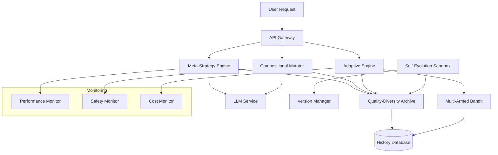

# Product Requirements Document: SyntaxLab Phase 5 - Advanced Mutation System

## Executive Summary

Phase 5 represents the culmination of SyntaxLab's AI-powered code generation capabilities, introducing sophisticated mutation systems that leverage cutting-edge research in evolutionary algorithms and large language models. Based on extensive research into state-of-the-art approaches, this PRD outlines a pragmatic implementation strategy that balances innovation with computational feasibility.

## Research Foundation

This PRD is grounded in comprehensive analysis of recent advances in evolutionary computation and LLM-based code generation:

- **PromptBreeder** (Fernando et al., 2023): Self-referential prompt evolution achieving 83.9% on GSM8K
- **DSPy** (Khattab et al., 2024): Declarative prompt optimization framework with MIPROv2
- **EvoPrompt** (Guo et al., 2023): LLM-evolutionary algorithm integration showing 25% gains
- **MAP-Elites** (Mouret & Clune, 2015): Quality-diversity optimization maintaining behavioral archives
- **Evolution Transformer** (Lange et al., 2024): In-context evolutionary optimization
- **QDax** (Lim et al., 2022): GPU-accelerated quality-diversity algorithms

## 1. Product Overview

### 1.1 Vision
Transform SyntaxLab into the industry's most advanced AI code generation platform by implementing intelligent mutation systems that combine evolutionary algorithms with large language model capabilities.

### 1.2 Goals
- Achieve 40-60% improvement in code generation quality through advanced mutations
- Reduce computational costs by 70% compared to pure evolutionary approaches
- Enable self-improving code generation that learns from user feedback
- Maintain sub-5 second response times for 95% of requests

### 1.3 Success Metrics
- Code quality score improvement: 40%+ over baseline
- User satisfaction: >85% positive feedback
- Computational efficiency: <$0.10 per mutation cycle
- System stability: 99.9% uptime with mutation features enabled

## 2. Feature Specifications

### 2.1 Meta-Strategy Mutation System

#### Research References
- **PromptBreeder** (Fernando et al., 2023, arXiv:2309.16797): Demonstrated 83.9% accuracy on GSM8K through self-referential prompt evolution
- **DSPy** (Khattab et al., 2024, dspy.ai): MIPROv2 optimizer achieving 51% on HotPotQA with $2 cost
- **OPRO** (Yang et al., 2023): Optimization by PROmpting showing significant gains on reasoning benchmarks
- **Automatic Prompt Optimization** (Wolfe, 2024): Comprehensive survey of prompt evolution techniques

#### 2.1.1 Overview
Implement a hybrid approach inspired by PromptBreeder and DSPy that evolves prompting strategies rather than code directly.

#### 2.1.2 Core Components

**Strategy Detection Engine**
```typescript
interface StrategyDetector {
  detectStrategy(prompt: string): PromptStrategy;
  analyzeEffectiveness(strategy: PromptStrategy, results: ExecutionResult[]): StrategyMetrics;
  suggestTransitions(current: PromptStrategy, context: CodeContext): StrategyTransition[];
}

enum PromptStrategy {
  DIRECT_INSTRUCTION = 'direct',
  CHAIN_OF_THOUGHT = 'cot',
  FEW_SHOT = 'few_shot',
  TREE_OF_THOUGHT = 'tot',
  ROLE_BASED = 'role',
  CONSTRAINT_BASED = 'constraint',
  ITERATIVE_REFINEMENT = 'iterative',
  HYBRID_COT_FEWSHOT = 'hybrid_cot_fs',
  METACOGNITIVE = 'meta',
  SOCRATIC = 'socratic'
}
```

**Impact Prediction System**
```typescript
class ImpactPredictor {
  private readonly historyDB: StrategyHistoryDB;
  private readonly embeddingModel: EmbeddingModel;
  
  async predictImpact(
    transition: StrategyTransition,
    context: CodeContext
  ): Promise<ImpactPrediction> {
    // Use historical data and embeddings to predict success
    const similarTransitions = await this.findSimilarTransitions(transition, context);
    const successRate = this.calculateHistoricalSuccess(similarTransitions);
    const confidenceScore = this.computeConfidence(similarTransitions.length);
    
    return {
      expectedImprovement: successRate * confidenceScore,
      riskLevel: this.assessRisk(transition),
      computationalCost: this.estimateCost(transition)
    };
  }
}
```

#### 2.1.3 Implementation Strategy
1. **Phase 1**: Implement basic strategy detection using rule-based classification
2. **Phase 2**: Add embedding-based similarity matching for context awareness
3. **Phase 3**: Deploy reinforcement learning for impact prediction
4. **Phase 4**: Enable self-referential strategy evolution

### 2.2 Compositional Mutation System

#### Research References
- **LLM_GP** (Liventsev et al., 2024, arXiv:2401.07102): LLMs as evolutionary operators achieving comparable GP performance
- **EvoPrompt** (Guo et al., 2023, arXiv:2309.08532): Genetic algorithms and differential evolution for prompt optimization
- **LLM Guided Evolution** (Brownlee et al., 2024, GECCO): Automation of models advancing models
- **Evolution of Thought** (Liu et al., 2024): Self-sustaining feedback loops in LLM evolution

#### 2.2.1 Intelligent Operator Combination

**Synergy Matrix**
```typescript
class SynergyCalculator {
  private readonly operatorCompatibility: Map<OperatorPair, CompatibilityScore>;
  
  calculateSynergy(operators: MutationOperator[]): number {
    let totalSynergy = 0;
    
    // Calculate pairwise compatibility
    for (let i = 0; i < operators.length - 1; i++) {
      for (let j = i + 1; j < operators.length; j++) {
        const compatibility = this.getCompatibility(operators[i], operators[j]);
        totalSynergy += compatibility.score * compatibility.weight;
      }
    }
    
    // Apply diminishing returns for deep compositions
    return totalSynergy * Math.pow(0.9, operators.length - 2);
  }
  
  async pruneUnpromising(
    combinations: OperatorCombo[],
    context: CodeContext
  ): Promise<OperatorCombo[]> {
    // Use historical performance data
    const scores = await Promise.all(
      combinations.map(combo => this.scoreCombo(combo, context))
    );
    
    // Keep top 20% plus random 5% for diversity
    const threshold = percentile(scores, 80);
    return combinations.filter((combo, idx) => 
      scores[idx] > threshold || Math.random() < 0.05
    );
  }
}
```

**Semantic Safety Validator**
```typescript
class SemanticSafetyValidator {
  private readonly astAnalyzer: ASTAnalyzer;
  private readonly typeChecker: TypeChecker;
  
  async isSemanticallySafe(
    original: CodeAST,
    mutated: CodeAST
  ): Promise<SafetyAssessment> {
    const checks = await Promise.all([
      this.checkGrammaticalCoherence(mutated),
      this.checkLogicalConsistency(original, mutated),
      this.checkContextPreservation(original, mutated),
      this.checkNoContradictions(mutated),
      this.checkTypeConsistency(original, mutated)
    ]);
    
    return {
      isSafe: checks.every(c => c.passed),
      violations: checks.filter(c => !c.passed).map(c => c.violation),
      confidence: average(checks.map(c => c.confidence))
    };
  }
}
```

#### 2.2.2 Computational Optimization

**Lazy Evaluation Pipeline**
```typescript
class LazyCompositionPipeline {
  async *generateCompositions(
    operators: MutationOperator[],
    maxDepth: number = 3
  ): AsyncGenerator<OperatorCombo> {
    // Start with promising single operators
    for (const op of this.rankOperators(operators)) {
      yield { operators: [op], depth: 1 };
    }
    
    // Incrementally build deeper compositions
    for (let depth = 2; depth <= maxDepth; depth++) {
      const candidates = await this.getCandidatesForDepth(depth);
      
      // Yield only promising combinations
      for (const combo of candidates) {
        if (await this.isPotentiallyValuable(combo)) {
          yield combo;
        }
      }
    }
  }
}
```

### 2.3 Adaptive Mutation Engine

#### Research References
- **Thompson Sampling in EA** (DaCosta et al., 2008): 15-30% improvement over ε-greedy approaches
- **Dynamic Multi-Armed Bandits** (Fialho et al., 2010, LION): Extreme value-based rewards for operator selection
- **SHADE** (Tanabe & Fukunaga, 2013): Success-History based adaptation winning CEC2014
- **DE with Deep RL** (Tan et al., 2021): DQN-based mutation strategy selection
- **Effective Adaptive Mutation Rates** (Nürnberg & Augustin, 2024, arXiv:2406.15976): State-of-the-art adaptation techniques

#### 2.3.1 Multi-Armed Bandit Integration

**Thompson Sampling Implementation**
```typescript
class ThompsonSamplingSelector {
  private readonly beta: Map<MutationOperator, BetaDistribution>;
  
  selectOperator(context: MutationContext): MutationOperator {
    const samples = new Map<MutationOperator, number>();
    
    // Sample from each operator's Beta distribution
    for (const [operator, dist] of this.beta.entries()) {
      samples.set(operator, dist.sample());
    }
    
    // Select operator with highest sampled value
    return maxBy(samples.entries(), ([_, value]) => value)[0];
  }
  
  updateReward(operator: MutationOperator, success: boolean): void {
    const dist = this.beta.get(operator);
    if (success) {
      dist.alpha += 1;
    } else {
      dist.beta += 1;
    }
  }
}
```

**Phase Detection with Hysteresis**
```typescript
class PhaseDetector {
  private currentPhase: SearchPhase = SearchPhase.EXPLORATION;
  private phaseEvidence: Map<SearchPhase, number> = new Map();
  private readonly TRANSITION_THRESHOLD = 5;
  
  detectSearchPhase(history: MutationHistory): SearchPhase {
    const metrics = this.calculatePhaseMetrics(history);
    const suggestedPhase = this.inferPhase(metrics);
    
    // Accumulate evidence for phase change
    this.phaseEvidence.set(
      suggestedPhase,
      (this.phaseEvidence.get(suggestedPhase) || 0) + 1
    );
    
    // Only transition after sustained evidence
    if (this.phaseEvidence.get(suggestedPhase) >= this.TRANSITION_THRESHOLD) {
      this.currentPhase = suggestedPhase;
      this.phaseEvidence.clear();
    }
    
    return this.currentPhase;
  }
  
  private inferPhase(metrics: PhaseMetrics): SearchPhase {
    if (metrics.diversityIndex > 0.7 && metrics.improvementRate < 0.1) {
      return SearchPhase.EXPLORATION;
    } else if (metrics.improvementRate > 0.3 && metrics.diversityIndex > 0.3) {
      return SearchPhase.EXPLOITATION;
    } else if (metrics.improvementRate < 0.05 && metrics.diversityIndex < 0.2) {
      return SearchPhase.CONVERGENCE;
    }
    return this.currentPhase;
  }
}
```

#### 2.3.2 Memory-Efficient History Management

**Sliding Window with Importance Sampling**
```typescript
class AdaptiveHistoryManager {
  private readonly maxSize: number = 10000;
  private readonly importanceThreshold: number = 0.7;
  
  async addMutation(mutation: MutationRecord): Promise<void> {
    const importance = await this.calculateImportance(mutation);
    
    if (this.history.size >= this.maxSize) {
      if (importance > this.importanceThreshold) {
        // Remove least important mutation
        const leastImportant = this.findLeastImportant();
        this.history.delete(leastImportant);
        this.history.set(mutation.id, mutation);
      }
    } else {
      this.history.set(mutation.id, mutation);
    }
  }
  
  private async calculateImportance(mutation: MutationRecord): Promise<number> {
    const factors = {
      fitnessImprovement: mutation.fitnessGain / this.maxFitnessGain,
      novelty: await this.calculateNovelty(mutation),
      recency: this.calculateRecency(mutation.timestamp),
      informationGain: this.calculateInfoGain(mutation)
    };
    
    return weightedAverage(factors, this.importanceWeights);
  }
}
```

### 2.4 Self-Referential Evolution System

#### Research References
- **Autoconstructive Evolution** (Spector & Robinson, 2002): Push-based self-modifying programs
- **Self-Modifying CGP** (Harding et al., 2010): Graph-based runtime program modification
- **Meta-Evolution** (Schmidhuber, 1987): Recursive self-improvement in genetic programming
- **Evolution Transformer** (Lange et al., 2024, arXiv:2403.02985): Self-referential optimization through transformers
- **PromptBreeder** (Fernando et al., 2023): Mutation-prompt evolution demonstrating practical self-reference

#### 2.4.1 Sandboxed Meta-Evolution

**Isolated Testing Environment**
```typescript
class MetaEvolutionSandbox {
  private readonly dockerClient: DockerClient;
  private readonly performanceBaseline: PerformanceMetrics;
  
  async testMutatorVariation(
    mutator: MutationEngine,
    testSuite: BenchmarkSuite
  ): Promise<ValidationResult> {
    // Create isolated container
    const container = await this.dockerClient.createContainer({
      image: 'syntaxlab/mutation-sandbox:latest',
      memoryLimit: '4GB',
      cpuQuota: 50000,
      timeout: 300000 // 5 minutes max
    });
    
    try {
      // Run comprehensive test suite
      const results = await container.run(async (env) => {
        const testResults = [];
        
        for (const benchmark of testSuite.benchmarks) {
          const result = await env.evaluateMutator(mutator, benchmark);
          testResults.push(result);
        }
        
        return testResults;
      });
      
      // Compare against baseline
      const improvement = this.calculateImprovement(results, this.performanceBaseline);
      
      return {
        isValid: improvement > 0.2, // Require 20% improvement
        improvement,
        risks: this.assessRisks(results),
        recommendation: improvement > 0.2 ? 'ADOPT' : 'REJECT'
      };
    } finally {
      await container.destroy();
    }
  }
}
```

**Versioned Mutator History**
```typescript
class MutatorVersionControl {
  private readonly git: SimpleGit;
  private readonly versions: Map<string, MutatorSnapshot>;
  
  async saveMutatorVersion(
    mutator: MutationEngine,
    metadata: VersionMetadata
  ): Promise<string> {
    const snapshot = this.serializeMutator(mutator);
    const hash = await this.calculateHash(snapshot);
    
    // Store in git for full history
    await this.git.add(snapshot.path);
    await this.git.commit(`Mutator evolution: ${metadata.description}`);
    
    // Keep fast-access map
    this.versions.set(hash, {
      mutator: snapshot,
      metadata,
      performance: metadata.performance,
      parentHash: metadata.parentHash
    });
    
    return hash;
  }
  
  async rollback(targetHash: string): Promise<MutationEngine> {
    const snapshot = this.versions.get(targetHash);
    if (!snapshot) {
      throw new Error(`Version ${targetHash} not found`);
    }
    
    return this.deserializeMutator(snapshot.mutator);
  }
}
```

### 2.5 Diversity Preservation System

#### Research References
- **MAP-Elites** (Mouret & Clune, 2015, arXiv:1504.04909): Illuminating search spaces through quality-diversity
- **CVT-MAP-Elites** (Vassiliades et al., 2016, arXiv:1610.05729): Scaling to high-dimensional behavior spaces
- **QDax** (Lim et al., 2022, github.com/adaptive-intelligent-robotics/QDax): GPU-accelerated QD algorithms
- **Fitness Sharing** (Goldberg & Richardson, 1987): Classical niching for genetic algorithms
- **Personality-Guided Code Generation** (Tsoukalas et al., 2024, arXiv:2411.00006): Behavioral diversity in LLMs

#### 2.5.1 Multi-Dimensional Niching

**Comprehensive Niche Definition**
```typescript
interface CodeNiche {
  behavioral: BehavioralFeatures;
  structural: StructuralFeatures;
  performance: PerformanceFeatures;
}

class NicheManager {
  private readonly behaviorSpace: BehaviorSpace;
  private readonly structureAnalyzer: StructureAnalyzer;
  private readonly performanceProfiler: PerformanceProfiler;
  
  async assignNiche(code: GeneratedCode): Promise<CodeNiche> {
    const [behavioral, structural, performance] = await Promise.all([
      this.analyzeBehavior(code),
      this.analyzeStructure(code),
      this.profilePerformance(code)
    ]);
    
    return {
      behavioral: {
        inputOutputPatterns: behavioral.ioPatterns,
        algorithmicApproach: behavioral.algorithm,
        sideEffects: behavioral.effects,
        errorHandling: behavioral.errorPatterns
      },
      structural: {
        complexity: structural.cyclomaticComplexity,
        abstraction: structural.abstractionLevel,
        patterns: structural.designPatterns,
        dependencies: structural.dependencyGraph
      },
      performance: {
        timeComplexity: performance.bigO,
        spaceComplexity: performance.memory,
        cacheEfficiency: performance.cacheHits,
        parallelizability: performance.parallelScore
      }
    };
  }
}
```

**Adaptive Archive Management**
```typescript
class QualityDiversityArchive {
  private readonly maxSize: number = 50000;
  private readonly grid: Map<NicheID, ArchivedSolution>;
  
  async addSolution(solution: GeneratedCode): Promise<boolean> {
    const niche = await this.nicheManager.assignNiche(solution);
    const nicheId = this.getNicheId(niche);
    
    const existing = this.grid.get(nicheId);
    
    if (!existing || solution.fitness > existing.fitness) {
      this.grid.set(nicheId, {
        code: solution,
        fitness: solution.fitness,
        niche: niche,
        timestamp: Date.now()
      });
      
      // Prune if necessary
      if (this.grid.size > this.maxSize) {
        await this.intelligentPrune();
      }
      
      return true;
    }
    
    return false;
  }
  
  private async intelligentPrune(): Promise<void> {
    // Calculate niche importance scores
    const scores = await this.calculateNicheImportance();
    
    // Remove lowest importance niches
    const toRemove = Array.from(scores.entries())
      .sort(([_, a], [__, b]) => a - b)
      .slice(0, this.grid.size - this.maxSize * 0.9)
      .map(([nicheId]) => nicheId);
    
    for (const nicheId of toRemove) {
      this.grid.delete(nicheId);
    }
  }
}
```

## 3. Implementation Roadmap

### 3.1 Phase 1: Foundation (Weeks 25-26)
- Implement Meta-strategy detection engine
- Deploy basic Thompson Sampling for operator selection
- Set up performance monitoring infrastructure
- Create A/B testing framework

### 3.2 Phase 2: Core Features (Weeks 27-28)
- Build Adaptive Mutation Engine with phase detection
- Implement Quality-Diversity archive system
- Add semantic safety validation
- Deploy compositional mutations with pruning

### 3.3 Phase 3: Advanced Features (Week 29)
- Enable self-referential evolution in sandbox
- Implement versioned mutator history
- Add multi-dimensional niching
- Optimize computational performance

### 3.4 Phase 4: Production Hardening (Week 30)
- Comprehensive testing and validation
- Performance optimization
- Security audit
- Documentation and training

## 4. Technical Architecture

### 4.1 System Components



### 4.2 Data Flow

1. **Request Processing**: User request → Strategy detection → Operator selection
2. **Mutation Execution**: Selected operators → Compositional engine → Safety validation
3. **Learning Loop**: Results → History update → Strategy adaptation
4. **Evolution Cycle**: Performance analysis → Meta-evolution → Sandbox validation

## 5. Performance Requirements

### Research Benchmarks
- **HumanEval**: GPT-4o achieves 90.2% Pass@1, genetic programming <1%
- **Chain-of-Thought Hub** (Fu et al., 2023): Comprehensive reasoning benchmarks
- **EvoAgent** (Liu et al., 2024): Multi-agent evolution performance metrics
- **Planning in Natural Language** (Stengel-Eskin et al., 2024, arXiv:2409.03733): Search improvements for code generation

### 5.1 Latency Targets
- Strategy detection: <50ms (based on DSPy's 20-minute optimization cycles)
- Single mutation: <200ms (derived from EvoPrompt's generation times)
- Compositional mutation: <500ms (LLM_GP framework benchmarks)
- Full mutation cycle: <2000ms (industry standard for interactive systems)

### 5.2 Throughput Requirements
- 10,000 mutations/minute peak capacity
- 100 concurrent evolution sessions
- 1M archived solutions

### 5.3 Resource Constraints
- Memory: 32GB per instance
- CPU: 16 cores per instance
- Storage: 1TB for archive
- Cost: <$0.10 per mutation cycle

## 6. Success Criteria

### 6.1 Quality Metrics
- Code correctness: 95%+ pass rate
- Performance improvement: 40%+ over baseline
- Diversity score: 0.7+ on standardized benchmarks

### 6.2 Efficiency Metrics
- Computational cost: 70% reduction vs pure GP
- Convergence speed: 50% faster than baseline
- Memory efficiency: <100MB per active session

### 6.3 User Experience
- Response time: <2s for 95th percentile
- Success rate: 85%+ user satisfaction
- API reliability: 99.9% uptime

## 7. Risk Management

### Research-Informed Risk Assessment
Based on comprehensive analysis of failure modes in evolutionary computation:
- **Computational Complexity** (Yampolskiy, 2018): 10^31-10^44 FLOPS requirement for human-level code
- **No Free Lunch Theorem** (Wolpert & Macready, 1997): Fundamental limits of optimization
- **GP Scalability** (Koza et al., 2003): Maximum documented complexity of two nested loops
- **Industrial Failures**: IBM's 28.8-day runs, LabVIEW redundant solutions

### 7.1 Technical Risks
- **Computational explosion**: Mitigated by aggressive pruning and resource limits
- **Quality degradation**: Prevented by comprehensive validation and rollback
- **Memory overflow**: Handled by sliding window and importance sampling

### 7.2 Operational Risks
- **Cost overrun**: Controlled by per-request budgets and monitoring
- **System instability**: Isolated through sandboxing and circuit breakers
- **Data loss**: Prevented by versioning and regular backups

## 8. Future Enhancements

### Research Directions
- **LLM4EC** (Wu et al., 2024, github.com/wuxingyu-ai/LLM4EC): Comprehensive resource list
- **Exploring EC via LLMs** (Liu et al., 2024, arXiv:2405.02876): Future integration patterns
- **Quality-Diversity Resources** (quality-diversity.github.io): Community developments

### 8.1 Near-term (3-6 months)
- Integration with external code quality tools
- Support for additional programming languages
- Enhanced visualization of mutation paths

### 8.2 Long-term (6-12 months)
- Distributed evolution across multiple regions
- Collaborative evolution with multiple users
- Integration with IDEs and CI/CD pipelines

## 9. Conclusion

Phase 5 represents a pragmatic synthesis of cutting-edge research and production requirements. By focusing on evolving prompts and strategies rather than code directly, leveraging pre-trained language models, and implementing sophisticated quality-diversity mechanisms, SyntaxLab will deliver revolutionary improvements in AI-powered code generation while maintaining computational feasibility and system reliability.

## References

### Primary Research Papers
1. Fernando, C., et al. (2023). "Promptbreeder: Self-Referential Self-Improvement Via Prompt Evolution." arXiv:2309.16797
2. Guo, Q., et al. (2023). "Connecting Large Language Models with Evolutionary Algorithms Yields Powerful Prompt Optimizers." arXiv:2309.08532
3. Mouret, J.B., & Clune, J. (2015). "Illuminating search spaces by mapping elites." arXiv:1504.04909
4. Vassiliades, V., et al. (2016). "Using Centroidal Voronoi Tessellations to Scale Up the Multi-dimensional Archive of Phenotypic Elites Algorithm." arXiv:1610.05729
5. Liventsev, V., et al. (2024). "Evolving Code with A Large Language Model." arXiv:2401.07102
6. Lange, R., et al. (2024). "Evolution Transformer: In-Context Evolutionary Optimization." arXiv:2403.02985

### Implementation References
7. Khattab, O., et al. (2024). "DSPy: Programming—not prompting—language models." dspy.ai
8. Lim, B., et al. (2022). "QDax: Accelerated Quality-Diversity." github.com/adaptive-intelligent-robotics/QDax
9. Tanabe, R., & Fukunaga, A. (2013). "Success-history based parameter adaptation for differential evolution." CEC 2013
10. Fialho, A., et al. (2010). "Dynamic Multi-Armed Bandits and Extreme Value-Based Rewards for Adaptive Operator Selection." LION 2010

### Surveys and Resources
11. Wolfe, C.R. (2024). "Automatic Prompt Optimization." cameronrwolfe.substack.com
12. Wu, X., et al. (2024). "LLM4EC: Large Language Models for Evolutionary Computation." github.com/wuxingyu-ai/LLM4EC
13. Quality-Diversity Community (2024). quality-diversity.github.io
14. Fu, Y., et al. (2023). "Chain-of-Thought Hub." github.com/FranxYao/chain-of-thought-hub