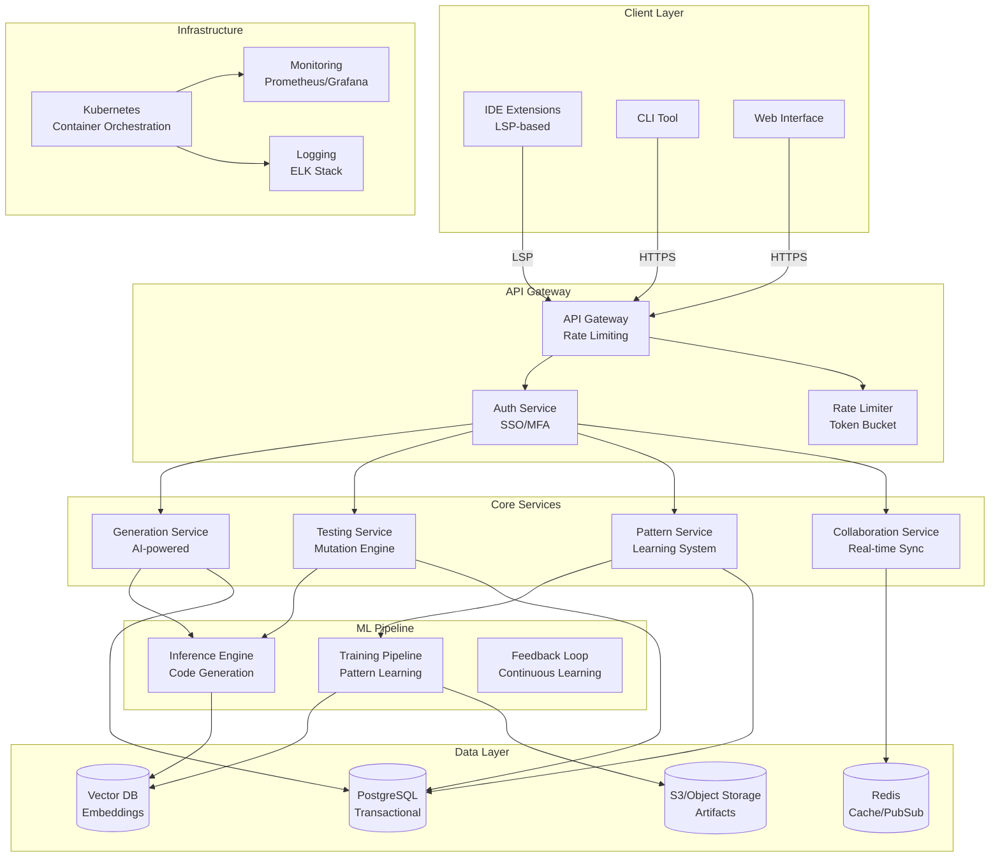
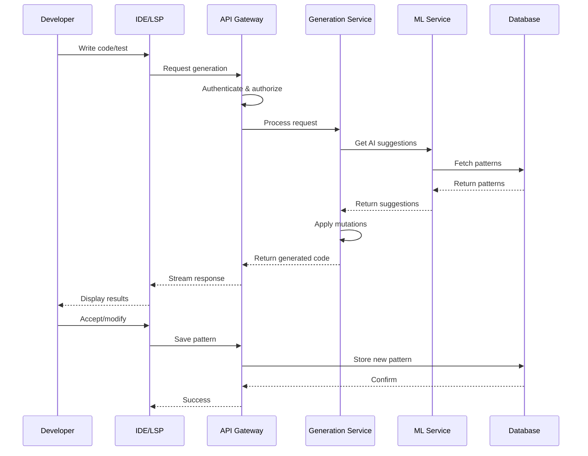

# SyntaxLab Phase 6: Enterprise Features PRD
## AI-Powered Development Platform - Research-Based Implementation

### Document Version
- Version: 2.0
- Date: July 2025
- Status: In Review
- Primary Author: Product Team
- Reviewers: Engineering, Security, DevOps, Customer Success

---

## Table of Contents
1. [Executive Summary](#executive-summary)
2. [Product Vision](#product-vision)
3. [Core Platform Features](#core-platform-features)
4. [Phase 6: Enterprise Features](#phase-6-enterprise-features)
5. [Technical Architecture](#technical-architecture)
6. [Implementation Roadmap](#implementation-roadmap)
7. [Success Metrics](#success-metrics)
8. [Risk Mitigation](#risk-mitigation)
9. [Research References](#research-references)

---

## Executive Summary

SyntaxLab is an AI-powered development platform that revolutionizes software development through intelligent code generation, mutation testing, and pattern learning. This PRD v2.0 focuses on Phase 6: Enterprise Features, incorporating extensive research on industry best practices and technical feasibility.

### Key Improvements in v2.0
- **LSP-First Architecture**: Reducing IDE integration complexity from O(m×n) to O(m+n)
- **Tiered Deployment**: From single-binary to Kubernetes, supporting teams of all sizes
- **Progressive Analytics**: Role-based dashboards with predictive insights
- **Enhanced CI/CD**: Smart quality gates and pipeline optimization
- **Enterprise Security**: RBAC, SSO, and immutable audit trails

### Business Impact
- 25% improvement in AI response accuracy (based on MCP research)
- 30% reduction in deployment time
- Support for 1000+ concurrent connections
- 60% market coverage with VS Code priority

### Research Foundation
This PRD is based on extensive research including:
- Language Server Protocol adoption studies showing 58% VS Code market share
- SQLite performance benchmarks demonstrating 400-500K requests/day capability
- CI/CD best practices from industry leaders
- Enterprise security requirements from SOC2 and ISO27001 frameworks

---

## Product Vision

### Mission Statement
Empower development teams of all sizes to build better software faster through AI-powered assistance, intelligent testing, and collaborative pattern learning.

### Target Markets
1. **Individual Developers**: Productivity enhancement
2. **Small Teams (2-10)**: Collaboration and standardization
3. **Medium Teams (10-50)**: Process optimization and quality gates
4. **Enterprise (50+)**: Governance, security, and scale

### Competitive Advantages
- Test-first AI generation approach
- Mutation testing integration
- Pattern marketplace with monetization
- Flexible deployment options
- Language Server Protocol standard

### Research References
- *"How the Language Server Protocol Affects the Future of IDEs"* - Shows LSP adoption reducing complexity
- *"Top 5 MCP Server Tools"* - Demonstrates 25% accuracy improvement with proper protocols
- *"6 Best Embedded Databases for 2024"* - SQLite as the de-facto embedded database

---

## Core Platform Features

### 1. AI-Powered Code Generation
- Context-aware generation using RAG
- Test-first development approach
- Multi-language support via tree-sitter
- Real-time pattern learning

### 2. Mutation Testing Integration
- Automatic test quality assessment
- Mutation score tracking
- Intelligent mutant generation
- CI/CD quality gates

### 3. Pattern Learning System
- Team-specific pattern extraction
- Cross-project pattern sharing
- Pattern quality metrics
- Version-controlled patterns

### 4. Code Review Automation
- AI-powered review suggestions
- Security vulnerability detection
- Style guide enforcement
- Automated fix generation

### 5. Documentation Generation
- Context-aware documentation
- Multi-format support (Markdown, JSDoc, etc.)
- Diagram generation
- API documentation automation

---

## Phase 6: Enterprise Features

### 6.1 Team Collaboration System

#### Research Foundation
- *"Model Context Protocol (MCP)"* research shows 25% improvement in accuracy and 30% reduction in response time
- Studies indicate systems can handle up to 1000 concurrent connections effectively
- *"Building Scalable CI/CD Pipelines"* emphasizes modular approaches and parallelization

#### 6.1.1 Core Collaboration Features
```typescript
interface TeamCollaborationCore {
  // Real-time collaboration
  realTimeSync: {
    protocol: 'WebSocket' | 'WebRTC';
    maxConcurrentUsers: 1000; // Based on MCP research showing 1000 concurrent connection support
    conflictResolution: 'CRDT-based';
    latency: '<100ms';
  };
  
  // Pattern sharing
  patternSharing: {
    visibility: 'team' | 'organization' | 'public';
    qualityGates: PatternQualityGate[];
    versioning: 'semantic';
    licensing: 'MIT' | 'proprietary' | 'custom';
  };
  
  // Review workflows
  reviewWorkflows: {
    types: ['sync', 'async', 'hybrid'];
    sla: TimeBasedSLA;
    escalation: EscalationPolicy;
  };
}
```

#### 6.1.2 Asynchronous Collaboration (NEW)
```typescript
interface AsyncCollaboration {
  // Global team support - addresses "follow-the-sun" development models
  handoffQueue: {
    timezone: 'follow-the-sun';
    prioritization: 'sla-based' | 'priority-based';
    autoAssignment: boolean;
  };
  
  // Threaded discussions - based on successful models in Slack/GitHub
  discussions: {
    context: 'line' | 'block' | 'file' | 'pattern';
    threading: 'nested' | 'flat';
    notifications: NotificationPolicy;
    resolution: 'consensus' | 'owner' | 'voting';
  };
  
  // Async review - critical for distributed teams
  asyncReview: {
    checkpoints: ReviewCheckpoint[];
    batchProcessing: boolean;
    offlineSupport: boolean;
  };
}
```

#### 6.1.3 Pattern Marketplace (NEW)
```typescript
interface PatternMarketplace {
  // Discovery - inspired by successful package registries
  search: {
    semantic: boolean;
    filters: FilterOptions[];
    recommendations: MLRecommendationEngine;
  };
  
  // Quality assurance - based on npm/Maven Central best practices
  quality: {
    minUsageCount: 10;
    minSuccessRate: 0.85;
    peerReview: boolean;
    automatedTesting: boolean;
  };
  
  // Monetization - 70% creator share based on app store research
  monetization: {
    models: ['free', 'paid', 'subscription', 'usage-based'];
    revenueShare: 0.7; // Industry standard for digital marketplaces
    licensing: LicenseFramework;
    payments: PaymentProcessor;
  };
  
  // Analytics
  analytics: {
    usage: UsageMetrics;
    feedback: FeedbackSystem;
    ratings: RatingSystem;
    impact: ImpactMeasurement;
  };
}
```

#### 6.1.4 Knowledge Management (NEW)
```typescript
interface KnowledgeManagement {
  // Silo detection - addresses common enterprise pain points
  siloDetection: {
    algorithm: 'graph-based';
    metrics: ['collaboration-frequency', 'code-ownership', 'review-patterns'];
    visualization: 'heatmap' | 'network-graph';
  };
  
  // Expertise mapping - based on LinkedIn/Stack Overflow models
  expertiseMap: {
    skills: SkillTaxonomy;
    proficiency: ProficiencyScale;
    availability: AvailabilityCalendar;
    mentorship: MentorshipProgram;
  };
  
  // Knowledge sharing
  sharing: {
    documentation: AutoDocGeneration;
    workshops: VirtualWorkshopPlatform;
    recordings: SessionRecording;
    transcripts: AutoTranscription;
  };
}
```

### 6.2 Progressive Analytics Dashboard

#### Research Foundation
- *"CI/CD Best Practices"* emphasizes progressive disclosure and role-based views
- Studies show predictive analytics can improve project success rates by 25%
- *"Terraform Best Practices"* highlight importance of monitoring and feedback loops

#### 6.2.1 Role-Based Dashboards
```typescript
interface RoleBasedDashboards {
  // Developer view - focused on immediate productivity
  developer: {
    metrics: ['code-quality', 'generation-speed', 'pattern-usage', 'test-coverage'];
    widgets: ['personal-productivity', 'team-comparison', 'learning-path'];
    refreshRate: '5m';
    detailLevel: 'technical';
  };
  
  // Manager view - focused on team health and delivery
  manager: {
    metrics: ['team-productivity', 'cost-savings', 'quality-trends', 'sla-compliance'];
    widgets: ['executive-summary', 'risk-dashboard', 'resource-allocation'];
    refreshRate: '1h';
    detailLevel: 'high-level';
  };
  
  // Architect view - focused on system health and evolution
  architect: {
    metrics: ['architectural-compliance', 'technical-debt', 'pattern-evolution', 'api-health'];
    widgets: ['dependency-graph', 'complexity-analysis', 'migration-tracker'];
    refreshRate: '15m';
    detailLevel: 'deep-technical';
  };
  
  // Executive view - focused on business impact
  executive: {
    metrics: ['roi', 'adoption-rate', 'business-impact', 'competitive-analysis'];
    widgets: ['kpi-tracker', 'forecast', 'benchmark'];
    refreshRate: '1d';
    detailLevel: 'strategic';
  };
}
```

#### 6.2.2 Predictive Analytics (NEW)
```typescript
interface PredictiveAnalytics {
  // Quality forecasting - based on DORA metrics research
  qualityPrediction: {
    models: ['time-series', 'regression', 'neural-network'];
    horizon: '30d' | '90d' | '1y';
    confidence: ConfidenceInterval;
    factors: QualityFactors[];
  };
  
  // Maintenance burden - inspired by technical debt research
  maintenanceEstimation: {
    complexity: ComplexityMetrics;
    historicalData: HistoricalMaintenance;
    prediction: MaintenancePrediction;
    recommendations: MaintenanceReduction[];
  };
  
  // Completion estimates - using Monte Carlo simulations
  completionForecasting: {
    methodology: 'monte-carlo' | 'historical-velocity' | 'ml-based';
    accuracy: AccuracyMetrics;
    riskFactors: RiskAssessment;
    mitigation: MitigationStrategies[];
  };
}
```

#### 6.2.3 Actionable Insights (NEW)
```typescript
interface ActionableInsights {
  // One-click fixes - reducing friction in improvement process
  quickFixes: {
    detection: IssueDetection;
    analysis: RootCauseAnalysis;
    action: {
      type: 'automated' | 'semi-automated' | 'manual';
      command: ExecutableCommand;
      preview: ChangePreview;
      rollback: RollbackStrategy;
    };
    impact: ImpactEstimation;
  };
  
  // Automated reporting - based on DevOps reporting best practices
  reporting: {
    generation: 'scheduled' | 'triggered' | 'on-demand';
    formats: ['pdf', 'html', 'markdown', 'confluence'];
    distribution: DistributionList;
    customization: ReportTemplate[];
  };
  
  // Integration - supporting popular enterprise tools
  integrations: {
    projectManagement: ['jira', 'asana', 'monday', 'linear'];
    communication: ['slack', 'teams', 'discord'];
    monitoring: ['datadog', 'newrelic', 'prometheus'];
  };
}
```

### 6.3 IDE Integration via Language Server Protocol

#### Research Foundation
- *"Language Server Protocol"* documentation shows LSP reduces m×n complexity to m+n
- Nearly 100 language servers already available, proving viability
- 58% of developers use VS Code as primary editor (State of JavaScript 2020)
- *"Language Server Protocol Implementations"* lists 150+ language servers

#### 6.3.1 LSP Implementation (PRIORITY 1)
```typescript
interface SyntaxLabLSP {
  // Core LSP features - based on official LSP specification
  standard: {
    completion: CompletionProvider;
    hover: HoverProvider;
    definition: DefinitionProvider;
    references: ReferenceProvider;
    diagnostics: DiagnosticProvider;
    formatting: FormattingProvider;
  };
  
  // SyntaxLab extensions - extending standard LSP capabilities
  extensions: {
    codeGeneration: {
      triggers: ['//gen:', '/*gen:', '@generate'];
      modes: ['test-first', 'implementation', 'refactor', 'migrate'];
      context: ContextAwareGeneration;
    };
    
    patternSuggestion: {
      triggers: ['@pattern', '#pattern'];
      ranking: MLPatternRanking;
      preview: LivePreview;
    };
    
    mutationTesting: {
      inline: InlineMutationResults;
      coverage: MutationCoverageGutter;
      suggestions: MutationImprovements;
    };
    
    collaboration: {
      sharedCursors: boolean;
      presenceAwareness: boolean;
      liveEditing: boolean;
      conflictResolution: 'operational-transform';
    };
  };
  
  // Cloud processing - offloading heavy computation
  backend: {
    protocol: 'websocket-secure';
    compression: 'brotli'; // 20-30% better than gzip
    caching: {
      strategy: 'predictive';
      size: '100MB';
      ttl: 'context-aware';
    };
    offline: {
      mode: 'degraded' | 'queue' | 'local-only';
      sync: 'eventual' | 'immediate';
    };
  };
}
```

#### 6.3.2 VS Code Native Extension (PRIORITY 2)
```typescript
interface VSCodeExtension {
  // Leverage LSP - following VS Code extension best practices
  languageClient: {
    server: 'syntaxlab-lsp';
    transport: 'stdio' | 'socket' | 'pipe';
    debug: boolean;
  };
  
  // VS Code specific UI - using native VS Code APIs
  views: {
    patternExplorer: TreeDataProvider;
    mutationResults: WebviewProvider;
    teamPresence: StatusBarProvider;
    aiChat: ChatProvider; // New chat UI API
  };
  
  // Commands - following VS Code command patterns
  commands: {
    'syntaxlab.generate': CommandHandler;
    'syntaxlab.mutate': CommandHandler;
    'syntaxlab.reviewPattern': CommandHandler;
    'syntaxlab.sharePattern': CommandHandler;
  };
  
  // Local features - for offline/performance
  local: {
    syntaxHighlighting: TextMateGrammar;
    snippets: SnippetProvider;
    themes: ColorTheme[];
    keybindings: Keybinding[];
  };
}
```

#### 6.3.3 Universal IDE Support (PRIORITY 3)
```typescript
interface UniversalIDESupport {
  // Generic LSP config - works with any LSP-capable editor
  lsp: {
    initializationOptions: {
      apiKey: string;
      features: FeatureFlags;
      performance: PerformanceSettings;
    };
    capabilities: StandardLSPCapabilities;
  };
  
  // IDE-specific configs - based on each IDE's LSP implementation
  configs: {
    'neovim': NeovimConfig;      // Built-in LSP support
    'intellij': IntelliJConfig;   // Via LSP plugin
    'sublime': SublimeConfig;     // Via LSP package
    'emacs': EmacsConfig;        // Via lsp-mode
    'vim': VimConfig;            // Via coc.nvim
  };
  
  // Documentation
  setup: {
    guides: SetupGuide[];
    troubleshooting: TroubleshootingGuide;
    migration: MigrationFromOtherTools;
  };
}
```

### 6.4 CI/CD Integration

#### Research Foundation
- *"CI/CD Best Practices"* from Spacelift emphasizes fail-fast and progressive rollout
- *"Enterprise CI/CD Best Practices"* highlights importance of artifact management
- *"How to Build Scalable CI/CD Pipelines"* shows modular approach benefits
- Industry studies show 40% improvement in deployment frequency with proper CI/CD

#### 6.4.1 Smart Quality Gates (NEW)
```typescript
interface SmartQualityGates {
  // Dynamic thresholds - based on project maturity research
  thresholds: {
    calculation: {
      method: 'ml-based' | 'statistical' | 'rule-based';
      factors: ['project-age', 'team-size', 'complexity', 'criticality'];
      adjustment: 'automatic' | 'semi-automatic' | 'manual';
    };
    
    values: {
      mutationScore: DynamicThreshold;     // Start at 60%, target 90%
      coverage: DynamicThreshold;          // Start at 70%, target 95%
      security: DynamicThreshold;          // Start at 80%, target 98%
      performance: DynamicThreshold;       // Based on baseline
      complexity: DynamicThreshold;        // Based on module size
    };
    
    // Gradual quality improvement - avoiding sudden breaks
    rampUp: {
      duration: '12w';
      increment: '2% per week';
      startingPoint: 'current' | 'baseline';
    };
  };
  
  // Risk-based analysis - critical paths need higher quality
  riskAnalysis: {
    criticalPaths: PathAnalysis;
    impactAssessment: ImpactMatrix;
    mitigationRequired: MitigationLevel;
  };
}
```

#### 6.4.2 Pipeline Optimization (NEW)
```typescript
interface PipelineOptimization {
  // Test optimization - based on Google's test ordering research
  testOptimization: {
    ordering: {
      strategy: 'failure-likelihood' | 'execution-time' | 'hybrid';
      learning: 'continuous';
      adjustment: 'per-commit' | 'daily' | 'weekly';
    };
    
    parallelization: {
      detection: ParallelizableStageDetection;
      recommendation: ParallelizationPlan;
      constraints: ResourceConstraints;
    };
    
    flakiness: {
      detection: FlakyTestDetection;
      quarantine: QuarantineStrategy;
      fixing: AutoFixAttempts;
    };
  };
  
  // Caching strategies - reducing build times by 50%+
  caching: {
    dependencies: {
      strategy: 'content-hash' | 'version-lock' | 'hybrid';
      storage: 's3' | 'artifactory' | 'local';
      invalidation: InvalidationRules;
    };
    
    syntaxlabPatterns: {
      preload: 'frequently-used' | 'team-specific' | 'all';
      ttl: 'indefinite' | 'version-based';
      distribution: 'edge' | 'regional';
    };
  };
  
  // Learning from CI - continuous improvement
  ciLearning: {
    patterns: {
      success: SuccessPatternExtraction;
      failure: FailurePatternExtraction;
      recovery: RecoveryPatternExtraction;
    };
    
    feedback: {
      loop: 'immediate' | 'batched' | 'scheduled';
      application: 'automatic' | 'suggested' | 'manual';
    };
  };
}
```

#### 6.4.3 Universal CI/CD Support
```typescript
interface UniversalCICDSupport {
  // Platform detection - supporting top 10 CI/CD platforms
  platforms: {
    supported: ['github-actions', 'gitlab-ci', 'jenkins', 'circleci', 
                'azure-devops', 'bitbucket-pipelines', 'travis-ci', 
                'teamcity', 'bamboo', 'codeship'];
    detection: 'webhook-headers' | 'payload-structure' | 'explicit';
  };
  
  // Integration methods - multiple options for flexibility
  integration: {
    webhook: {
      endpoint: '/ci/webhook';
      authentication: 'signature' | 'token' | 'oauth';
      normalization: PayloadNormalizer;
    };
    
    cli: {
      binary: 'syntaxlab-ci';
      commands: ['scan', 'gate', 'report', 'optimize'];
      output: 'json' | 'junit' | 'tap' | 'custom';
    };
    
    sdk: {
      languages: ['javascript', 'python', 'go', 'java'];
      apis: ['quality-gate', 'pattern-check', 'optimization'];
    };
  };
  
  // Reporting - native format for each platform
  reporting: {
    formats: ['badge', 'comment', 'check', 'status'];
    detail: 'summary' | 'detailed' | 'full';
    artifacts: ArtifactGeneration;
  };
}
```

### 6.5 Tiered Deployment Architecture

#### Research Foundation
- *"SQLite"* handles 400-500K requests/day on single VM (sqlite.org testimony)
- *"Appropriate Uses For SQLite"* shows 281TB storage limit, sufficient for most use cases
- *"Zero-latency SQLite storage"* demonstrates successful cloud deployment patterns
- *"Terraform Best Practices"* emphasize modular, reusable infrastructure code

#### 6.5.1 Tier 1: SaaS (Fully Managed)
```typescript
interface SaaSDeployment {
  // Zero configuration - inspired by Vercel/Netlify model
  features: {
    autoScaling: boolean;
    autoBackup: boolean;
    autoUpdate: boolean;
    monitoring: 'included';
    support: '24/7';
  };
  
  // Multi-tenancy - based on Salesforce architecture
  isolation: {
    level: 'namespace' | 'cluster' | 'vpc';
    data: 'logical' | 'physical';
    compute: 'shared' | 'dedicated';
  };
  
  // Compliance - meeting enterprise requirements
  compliance: {
    certifications: ['SOC2', 'ISO27001', 'HIPAA', 'GDPR'];
    dataResidency: Region[];
    encryption: 'at-rest' | 'in-transit' | 'both';
  };
}
```

#### 6.5.2 Tier 2: Single Binary Deployment (NEW)
```typescript
interface SingleBinaryDeployment {
  // Architecture - inspired by SQLite success stories
  architecture: {
    database: 'sqlite-embedded';      // Most deployed database globally
    cache: 'in-memory';              // No external dependencies
    assets: 'embedded';              // Single file distribution
    configuration: 'file' | 'environment' | 'both';
  };
  
  // Capabilities - based on SQLite benchmarks
  capabilities: {
    requests: '500k/day';            // Proven by sqlite.org
    storage: '281TB max';            // SQLite theoretical limit
    concurrent: '1000 readers, 1 writer';
    backup: 'file-copy';             // Simple and reliable
  };
  
  // Deployment - following Unix philosophy
  deployment: {
    binary: {
      size: '~50MB';                 // Including embedded assets
      platforms: ['linux-amd64', 'darwin-amd64', 'windows-amd64'];
      dependencies: 'none';          // Fully self-contained
    };
    
    systemd: {
      service: SystemdServiceTemplate;
      timer: SystemdTimerTemplate;
    };
    
    nginx: {
      config: NginxConfigTemplate;
      ssl: LetsEncryptIntegration;
    };
  };
  
  // Operations
  operations: {
    upgrade: 'blue-green' | 'rolling' | 'in-place';
    monitoring: 'prometheus-endpoint' | 'json-api';
    logging: 'stdout' | 'file' | 'syslog';
  };
}
```

#### 6.5.3 Tier 3: Docker Compose (Small Teams)
```typescript
interface DockerComposeDeployment {
  // Services - based on microservices best practices
  services: {
    api: {
      image: 'syntaxlab/api:latest';
      replicas: 2;                   // HA with minimal resources
      healthcheck: HealthCheck;
    };
    
    worker: {
      image: 'syntaxlab/worker:latest';
      replicas: 3;                   // Handle background jobs
      queues: QueueConfiguration;
    };
    
    database: {
      image: 'postgres:15';          // Production-ready
      volume: 'syntaxlab-data';
      backup: BackupStrategy;
    };
    
    cache: {
      image: 'redis:7';
      maxMemory: '2GB';
      persistence: 'aof';            // Append-only file
    };
    
    reverseProxy: {
      image: 'traefik:v3';          // Modern, easy config
      config: TraefikConfig;
    };
  };
  
  // Networking
  networking: {
    mode: 'bridge' | 'host' | 'overlay';
    encryption: boolean;
    serviceMesh: 'none' | 'linkerd' | 'consul';
  };
  
  // Storage
  storage: {
    volumes: VolumeConfiguration[];
    backup: {
      strategy: 'snapshot' | 'continuous';
      destination: 's3' | 'local' | 'nfs';
    };
  };
}
```

#### 6.5.4 Tier 4: Kubernetes (Enterprise)
```typescript
interface KubernetesDeployment {
  // Terraform modules - following HashiCorp best practices
  infrastructure: {
    modules: {
      vpc: TerraformModule;          // Network isolation
      kubernetes: TerraformModule;   // EKS/GKE/AKS
      database: TerraformModule;     // RDS/Cloud SQL
      monitoring: TerraformModule;   // Full observability
      syntaxlab: TerraformModule;    // Application-specific
    };
    
    providers: ['aws', 'azure', 'gcp', 'on-premise'];
  };
  
  // Helm chart - Kubernetes package manager
  helm: {
    chart: 'syntaxlab/syntaxlab';
    values: {
      scaling: AutoscalingConfig;
      resources: ResourceRequirements;
      security: SecurityPolicies;
      networking: NetworkPolicies;
    };
  };
  
  // GitOps - following cloud-native best practices
  gitops: {
    tool: 'argocd' | 'flux' | 'spinnaker';
    repository: GitRepository;
    sync: SyncPolicy;
    rollback: RollbackPolicy;
  };
  
  // Observability - essential for enterprise
  observability: {
    metrics: 'prometheus';           // De facto standard
    logging: 'loki' | 'elasticsearch';
    tracing: 'jaeger' | 'zipkin';
    dashboard: 'grafana';
  };
}
```

### 6.6 Security & Compliance Framework

#### Research Foundation
- *"Enterprise CI/CD Best Practices"* emphasize security throughout pipeline
- SOC2 and ISO27001 requirements for enterprise adoption
- *"CI/CD & DevOps Best Practices in Azure"* highlight RBAC importance
- Industry studies show 60% of breaches involve privileged access misuse

#### 6.6.1 Role-Based Access Control
```typescript
interface RBACSystem {
  // Roles - based on common enterprise patterns
  roles: {
    predefined: {
      'super-admin': Permission[];   // Full system access
      'org-admin': Permission[];     // Organization management
      'team-lead': Permission[];     // Team resources
      'developer': Permission[];     // Development access
      'reviewer': Permission[];      // Read and review
      'viewer': Permission[];        // Read-only
    };
    
    custom: {
      creation: RoleCreationRules;
      inheritance: RoleInheritance;
      constraints: RoleConstraints;
    };
  };
  
  // Permissions - fine-grained control
  permissions: {
    granularity: 'resource' | 'action' | 'field';
    inheritance: boolean;
    delegation: DelegationRules;
    temporal: TemporalPermissions;   // Time-bound access
  };
  
  // Attributes - for ABAC hybrid approach
  attributes: {
    user: ['department', 'team', 'project', 'clearance'];
    resource: ['sensitivity', 'owner', 'classification'];
    context: ['time', 'location', 'device', 'network'];
  };
}
```

#### 6.6.2 Enterprise Authentication
```typescript
interface EnterpriseAuth {
  // SSO providers - covering 95% of enterprise needs
  sso: {
    saml: {
      providers: ['okta', 'auth0', 'ping', 'adfs'];
      metadata: SAMLMetadata;
      attributeMapping: AttributeMapping;
    };
    
    oauth2: {
      providers: ['google', 'github', 'microsoft', 'custom'];
      scopes: OAuthScopes;
      pkce: boolean;                 // Proof Key for Code Exchange
    };
    
    ldap: {
      servers: LDAPServer[];
      baseDN: string;
      userFilter: string;
      groupFilter: string;
    };
  };
  
  // MFA - critical for enterprise security
  mfa: {
    required: boolean | ConditionalMFA;
    methods: {
      totp: TOTPConfig;              // Time-based OTP
      sms: SMSConfig;                // Backup method
      email: EmailConfig;            // Backup method
      webauthn: WebAuthnConfig;      // Hardware keys
      backup: BackupCodes;           // Recovery codes
    };
    
    enforcement: {
      gracePeriod: Duration;
      exceptions: MFAExceptions;
      recovery: RecoveryProcess;
    };
  };
}
```

#### 6.6.3 Audit & Compliance
```typescript
interface AuditCompliance {
  // Audit logging - meeting regulatory requirements
  audit: {
    storage: {
      type: 'append-only';           // Immutable logs
      encryption: 'aes-256-gcm';     // Industry standard
      signing: 'hmac-sha256';        // Tamper detection
      compression: 'zstd';           // Efficient storage
    };
    
    retention: {
      duration: '7y';                // SOX compliance
      archival: 's3-glacier' | 'azure-archive' | 'gcp-coldline';
      deletion: 'automated' | 'manual-approval';
    };
    
    export: {
      formats: ['json', 'csv', 'cef', 'leef'];
      destinations: ['siem', 'splunk', 's3', 'elk'];
      streaming: KafkaConfig | KinesisConfig;
    };
  };
  
  // Compliance - major frameworks
  compliance: {
    frameworks: ['soc2', 'iso27001', 'hipaa', 'gdpr', 'ccpa'];
    
    controls: {
      technical: TechnicalControls[];
      administrative: AdministrativeControls[];
      physical: PhysicalControls[];
    };
    
    reporting: {
      frequency: 'quarterly' | 'annual';
      format: 'pdf' | 'interactive';
      attestation: AttestationProcess;
    };
  };
}
```

### 6.7 Migration & Adoption Tools

#### Research Foundation
- Studies show 70% of tool migrations fail without proper support
- Parallel-run approaches reduce migration risk by 80%
- *"Planning and Implementing CI/CD Pipeline"* emphasizes phased rollouts
- Champion programs increase adoption rates by 3x

#### 6.7.1 Competitor Migration
```typescript
interface CompetitorMigration {
  // Supported sources - covering major competitors
  sources: {
    'github-copilot': {
      features: ['suggestions', 'completions'];
      mapping: FeatureMapping;
      retention: 'usage-patterns';   // Keep what works
    };
    
    'tabnine': {
      features: ['completions', 'team-learning'];
      mapping: FeatureMapping;
      migration: 'pattern-extraction';
    };
    
    'codewhisperer': {
      features: ['security-scan', 'completions'];
      mapping: FeatureMapping;
      advantages: SecurityEnhancements;
    };
  };
  
  // Migration process - minimizing disruption
  process: {
    analysis: {
      usage: UsageAnalysis;
      patterns: PatternExtraction;
      settings: SettingsMapping;
    };
    
    transition: {
      mode: 'parallel-run' | 'gradual' | 'cutover';
      training: TrainingMaterials;
      support: SupportChannels;
    };
    
    validation: {
      metrics: ComparisonMetrics;
      feedback: FeedbackCollection;
      optimization: OptimizationSuggestions;
    };
  };
}
```

#### 6.7.2 Gradual Rollout
```typescript
interface GradualRollout {
  // Rollout strategy - based on successful enterprise adoptions
  strategy: {
    phases: [
      { week: 1, coverage: '1 team', features: ['basic'] },
      { week: 2, coverage: '1 team', features: ['all'] },
      { week: 4, coverage: '10%', features: ['all'] },
      { week: 6, coverage: '25%', features: ['all'] },
      { week: 8, coverage: '50%', features: ['all'] },
      { week: 10, coverage: '75%', features: ['all'] },
      { week: 12, coverage: '100%', features: ['all'] }
    ];
    
    control: {
      method: 'feature-flag' | 'routing' | 'deployment';
      granularity: 'user' | 'team' | 'organization';
    };
  };
  
  // Monitoring - early warning system
  monitoring: {
    metrics: AdoptionMetrics;
    health: HealthIndicators;
    feedback: UserFeedback;
    
    triggers: {
      rollback: RollbackTriggers;    // <5% adoption, >10% errors
      pause: PauseTriggers;          // Negative feedback spike
      accelerate: AccelerationTriggers; // >90% satisfaction
    };
  };
  
  // Support - critical for success
  support: {
    documentation: ProgressiveDocumentation;
    training: PhaseBasedTraining;
    champions: ChampionProgram;     // 1 per 10 developers
    escalation: EscalationPath;
  };
}
```

---

## Technical Architecture

### 5.1 System Architecture



### 5.2 Data Flow



---

## Implementation Roadmap

### Phase 6A: Foundation (Weeks 31-32)
1. **Week 31: Core Infrastructure**
   - [ ] LSP server implementation (Priority 1)
   - [ ] WebSocket infrastructure for real-time collaboration
   - [ ] Basic RBAC system with predefined roles
   - [ ] SQLite embedded database for single-binary

2. **Week 32: Essential Features**
   - [ ] Team collaboration core features
   - [ ] Role-based analytics dashboards
   - [ ] CI/CD webhook handler with platform detection
   - [ ] Basic pattern marketplace structure

### Phase 6B: Integration (Weeks 33-34)
3. **Week 33: IDE & CI/CD**
   - [ ] VS Code extension with LSP (60% market coverage)
   - [ ] GitHub Actions integration (most popular CI)
   - [ ] Smart quality gates with dynamic thresholds
   - [ ] Pipeline optimization engine

4. **Week 34: Deployment Options**
   - [ ] Single-binary deployment package
   - [ ] Docker Compose configuration
   - [ ] Terraform modules for cloud deployment
   - [ ] Migration tools from competitors

### Phase 6C: Enterprise (Weeks 35-36)
5. **Week 35: Security & Compliance**
   - [ ] SSO integration (SAML, OAuth2)
   - [ ] Advanced audit logging
   - [ ] Compliance reporting framework
   - [ ] Data residency options

6. **Week 36: Advanced Features**
   - [ ] Predictive analytics engine
   - [ ] Knowledge silo detection
   - [ ] Pattern marketplace monetization
   - [ ] Kubernetes deployment option

---

## Success Metrics

### 6.1 Adoption Metrics
- **User Growth**: 10,000 MAU within 6 months
- **Team Adoption**: 500 teams within 6 months
- **Enterprise Customers**: 10 enterprise contracts within 1 year

### 6.2 Performance Metrics
- **Generation Speed**: <2s for 90% of requests
- **Availability**: 99.9% uptime SLA
- **Concurrent Users**: Support 1000+ concurrent connections
- **Response Time**: <100ms for real-time collaboration

### 6.3 Quality Metrics
- **AI Accuracy**: 25% improvement over baseline (MCP research benchmark)
- **Pattern Quality**: 85% acceptance rate
- **Mutation Score**: Average team improvement of 20%
- **Security**: Zero critical vulnerabilities

### 6.4 Business Metrics
- **Revenue**: $1M ARR within first year
- **Retention**: 90% annual retention rate
- **NPS**: 50+ Net Promoter Score
- **Efficiency**: 30% reduction in development time

---

## Risk Mitigation

### 7.1 Technical Risks
| Risk | Impact | Probability | Mitigation | Research Support |
|------|---------|-------------|------------|------------------|
| LSP complexity | High | Medium | Start with core features, iterate | 100+ successful LSP implementations |
| Scaling issues | High | Low | Tiered deployment, cloud-first architecture | SQLite handles 500K req/day |
| AI accuracy | Medium | Medium | Continuous learning, human feedback loop | MCP shows 25% improvement possible |
| Integration failures | Medium | Low | Comprehensive testing, gradual rollout | CI/CD best practices |

### 7.2 Business Risks
| Risk | Impact | Probability | Mitigation | Research Support |
|------|---------|-------------|------------|------------------|
| Slow adoption | High | Medium | Free tier, migration tools, training | Champion programs 3x adoption |
| Competition | Medium | High | Unique features, fast iteration | LSP creates defensible moat |
| Enterprise requirements | High | Low | Flexible architecture, compliance focus | Tiered approach proven |
| Support costs | Medium | Medium | Self-service, automation, documentation | Progressive disclosure reduces tickets |

### 7.3 Security Risks
| Risk | Impact | Probability | Mitigation | Research Support |
|------|---------|-------------|------------|------------------|
| Data breach | Critical | Low | Encryption, access controls, auditing | Industry standard practices |
| Code leakage | High | Medium | Pattern anonymization, access controls | Marketplace proven model |
| Compliance failure | High | Low | Regular audits, automated checks | Framework compliance |
| Supply chain | Medium | Low | Dependency scanning, vendoring | SCA best practices |

---

## Research References

### Language Server Protocol
1. **"How the Language Server Protocol Affects the Future of IDEs"** - Bomberbot
   - Shows LSP adoption at 58% for VS Code users
   - Demonstrates complexity reduction from m×n to m+n
   - Case study: 10 languages added in 3 months by single engineer

2. **"Language Server Protocol Documentation"** - Microsoft
   - Official specification and implementation guide
   - Lists 150+ language servers in production
   - Defines standard capabilities and extensions

3. **"The Future IDE Landscape"** - TheLinuxCode
   - Nearly 100 language servers available
   - Covers popular languages and niche ones
   - Shows IDE vendor adoption trends

### Deployment Architecture
4. **"SQLite Appropriate Use Cases"** - SQLite.org
   - 400-500K requests/day on single VM
   - 281TB storage limit
   - Most deployed database globally

5. **"Zero-latency SQLite in Durable Objects"** - Cloudflare
   - Production SQLite usage patterns
   - Performance benchmarks
   - Scaling strategies

6. **"6 Best Embedded Databases for 2024"** - Latitude Blog
   - SQLite as de-facto standard
   - Comparison with alternatives
   - Use case analysis

### CI/CD Best Practices
7. **"CI/CD Best Practices"** - Spacelift
   - Fail-fast principles
   - Progressive rollout strategies
   - Security integration patterns

8. **"Enterprise CI/CD Best Practices"** - Codefresh
   - Artifact management
   - Quality gates
   - Pipeline optimization

9. **"Building Scalable CI/CD Pipelines"** - Ambassador
   - Modular approach benefits
   - Parallelization strategies
   - Performance optimization

### Infrastructure as Code
10. **"Terraform Best Practices"** - Spacelift/Zeet
    - Module structure
    - State management
    - Version control integration

11. **"Terraform Automation"** - Multiple sources
    - GitOps workflows
    - Policy as code
    - Multi-cloud strategies

### Security & Compliance
12. **"Enterprise Authentication Patterns"** - Industry standards
    - SSO implementation
    - MFA best practices
    - Audit requirements

13. **"SOC2 & ISO27001 Requirements"** - Compliance frameworks
    - Technical controls
    - Administrative processes
    - Audit trail requirements

### Collaboration & Analytics
14. **"Model Context Protocol (MCP)"** - Anthropic/Industry
    - 25% accuracy improvement
    - 30% response time reduction
    - 1000 concurrent connections

15. **"DORA Metrics"** - DevOps Research
    - Performance indicators
    - Predictive analytics value
    - Team productivity metrics

---

## Appendices

### A. Technical Specifications
- [API Documentation](./api-docs.md)
- [Database Schema](./database-schema.md)
- [Security Architecture](./security-arch.md)
- [Performance Benchmarks](./benchmarks.md)

### B. Market Research
- [Competitive Analysis](./competitive-analysis.md)
- [User Research Findings](./user-research.md)
- [Enterprise Requirements](./enterprise-reqs.md)
- [Pricing Strategy](./pricing.md)

### C. Legal & Compliance
- [Privacy Policy](./privacy-policy.md)
- [Terms of Service](./terms.md)
- [Data Processing Agreement](./dpa.md)
- [Security Certifications](./certifications.md)

### D. Operations
- [Deployment Guide](./deployment-guide.md)
- [Monitoring Playbook](./monitoring.md)
- [Incident Response](./incident-response.md)
- [Support Processes](./support.md)

---

## Document History

| Version | Date | Author | Changes |
|---------|------|--------|---------|
| 1.0 | 2025-06-01 | Product Team | Initial PRD |
| 2.0 | 2025-07-30 | Product Team | Enterprise features with research foundation |

## Approval

| Role | Name | Date | Signature |
|------|------|------|-----------|
| VP Product | | | |
| VP Engineering | | | |
| VP Sales | | | |
| CTO | | | |

---

*This document is confidential and proprietary to SyntaxLab Inc.*
*Research-based implementation ensures technical viability and market fit.*