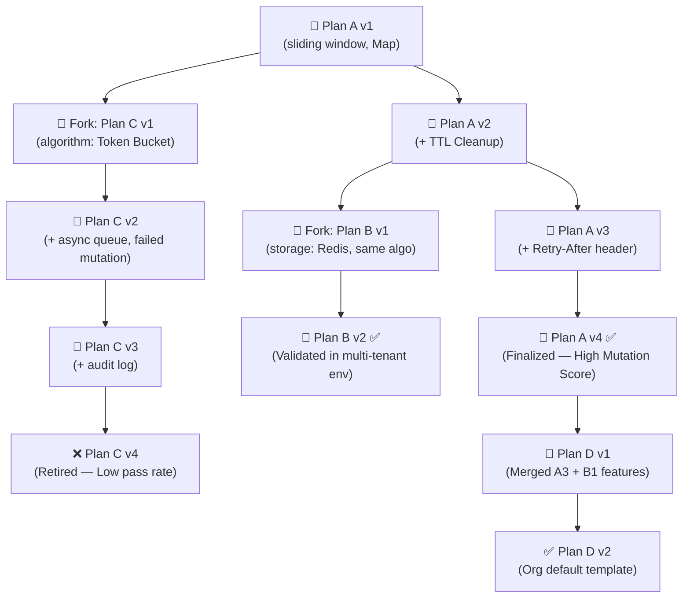

```mermaid
graph TD

%% Root plan and lineage
A0["🧠 Plan A v1<br>(sliding window, Map)"] --> A1["🧠 Plan A v2<br>(+ TTL Cleanup)"]
A1 --> A2["🧠 Plan A v3<br>(+ Retry-After header)"]
A2 --> A3["🧠 Plan A v4 ✅<br>(Finalized — High Mutation Score)"]

%% Fork from plan A due to storage change
A1 --> B0["🔁 Fork: Plan B v1<br>(storage: Redis, same algo)"]
B0 --> B1["🧠 Plan B v2 ✅<br>(Validated in multi-tenant env)"]

%% Second fork: changes algorithm
A0 --> C0["🔁 Fork: Plan C v1<br>(algorithm: Token Bucket)"]
C0 --> C1["🧠 Plan C v2<br>(+ async queue, failed mutation)"]
C1 --> C2["🧠 Plan C v3<br>(+ audit log)"]
C2 --> C3["❌ Plan C v4<br>(Retired — Low pass rate)"]

%% Merge two successful variants
A3 --> D0["🧬 Plan D v1<br>(Merged A3 + B1 features)"]
D0 --> D1["✅ Plan D v2<br>(Org default template)"]
```