```mermaid
graph TD

%% Root plan and lineage
A0["🧠 Plan A v1<br>(sliding window, Map)"] --> A1["🧠 Plan A v2<br>(+ TTL Cleanup)"]
A1 --> A2["🧠 Plan A v3<br>(+ Retry-After header)"]
A2 --> A3["🧠 Plan A v4 ✅<br>(Finalized — High Mutation Score)"]

%% Fork from plan A due to storage change
A1 --> B0["🔁 Fork: Plan B v1<br>(storage: Redis, same algo)"]
B0 --> B1["🧠 Plan B v2 ✅<br>(Validated in multi-tenant env)"]

%% Second fork: changes algorithm
A0 --> C0["🔁 Fork: Plan C v1<br>(algorithm: Token Bucket)"]
C0 --> C1["🧠 Plan C v2<br>(+ async queue, failed mutation)"]
C1 --> C2["🧠 Plan C v3<br>(+ audit log)"]
C2 --> C3["❌ Plan C v4<br>(Retired — Low pass rate)"]

%% Merge two successful variants
A3 --> D0["🧬 Plan D v1<br>(Merged A3 + B1 features)"]
D0 --> D1["✅ Plan D v2<br>(Org default template)"]
```

# Product Requirements Document (PRD)

## Title: Pseudocode Plan Evolution and Feedback Framework

**Version:** 1.0
**Author:** SyntaxLab Product Team
**Date:** 2025-07-30

---

## 1. Overview

This document outlines the implementation plan for enhancing SyntaxLab's code generation system with:

* Logic-level Chain of Thought (L-CoT) pseudocode planning
* Versioned plan tracking and refinement
* Semantic plan comparison and scoring
* Plan clustering, forking, merging, and retirement
* Visual diffing and lineage traceability

These features aim to significantly reduce downstream validation cost, improve code correctness, and enable transparent reasoning about code structure before generation.

---

## 2. Goals

* Generate structured pseudocode plans (logic traces) before emitting code
* Score pseudocode plans based on downstream success (refinement count, validation rate)
* Use scoring feedback to improve the quality of future plans
* Track evolution of plans over time (versioning, forking, merging)
* Provide visual diffing and lineage graph for each logic plan

---



---

## 3. Functional Requirements

### 3.1 Pseudocode Plan Generator (L-CoT Planner)

* Accepts user prompt and context
* Outputs:

  * Stepwise pseudocode with rationales
  * Structured logic plan:

    ```ts
    type LogicPlan = {
      id: string;
      version: number;
      parentId?: string;
      steps: string[];
      structured: {
        algorithm: string;
        storage: string;
        validation: string;
        errorHandling: string;
        compliance: string;
      };
      metrics: LogicPlanMetrics;
      status: "active" | "forked" | "merged" | "retired";
    }
    ```

### 3.2 Plan Versioning Engine

* Auto-increments version after successful refinement
* Tracks parent-child relationships
* Adds `forkedFrom` when divergent changes occur
* Adds `mergedFrom` array when consolidated

### 3.3 Feedback Scorer

* Inputs: Plan ID, validation metrics (e.g., mutation score, refinement rounds)
* Updates historical fields:

  ```ts
  type LogicPlanMetrics = {
    usageCount: number;
    avgRefinements: number;
    validationPassRate: number;
    mutationScoreAvg: number;
  };
  ```

### 3.4 Diversity Comparator

* Compares any two plans by:

  * Levenshtein distance on steps
  * Semantic diff on structured fields
* Calculates a `diversityScore ∈ [0,1]`
* Detects over-convergence or under-diversification

### 3.5 Visual Diff + Graph Builder

* Generates:

  * Textual diff view between two versions
  * Mermaid-based lineage graph
  * Embedding-based similarity heatmaps (future)

### 3.6 Feedback Loop Controller

* Routes failed or refined code generations back to:

  * Adjust prompt
  * Adjust pseudocode steps
  * Fork or evolve the underlying plan

---

## 4. Non-Functional Requirements

* Plan storage must be deduplicated by plan hash
* All diffs must be auditable and timestamped
* Scoring updates must be batched + cached for performance
* Plan graphs should support up to 10k historical plans per org

---

## 5. Technical Architecture

```
[ Prompt ]
   ↓
[L-CoT Planner]
   ↓
[Logic Plan] → [Plan DB] ←→ [Feedback Metrics]
     ↓                  ↑
[Code Generator]     [Validation Pipeline]
     ↓                  ↓
[Mutation Score] → [Feedback Scorer] → [Version Updater]
                                ↓
                             [Fork / Merge / Retire]
```

---

## 6. Milestones

### Phase 1: Core Plan Engine (Weeks 1–2)

* Generate plan objects with versioning
* Save/load/query by ID
* Basic diff viewer

### Phase 2: Feedback + Scoring (Weeks 3–4)

* Record usageCount, refinement rounds, validation score
* Gate plan upgrades via success metrics

### Phase 3: Forking + Merging Engine (Weeks 5–6)

* Compare semantic distance between plans
* Detect divergence to fork
* Merge compatible plans based on lineage and pass rate

### Phase 4: Visualization + Auditing (Weeks 7–8)

* Display lineage graphs in UI
* Visual diff of steps and structured logic fields

---

## 7. Success Criteria

| Metric                | Target            |
| --------------------- | ----------------- |
| Mutation score lift   | +10% post v1      |
| Refinement reduction  | −30% iterations   |
| Plan convergence rate | ≥ 85%             |
| Plan diversity        | ≥ 0.6 avg score   |
| Visual audit coverage | 100% lineage view |

---

## 8. Future Extensions

* Plan clustering (unsupervised + curated)
* Fine-tuned model to suggest plan deltas
* Replayable plan editor (with approval flow)
* Template ranking leaderboard by domain or language

---

## 9. Appendix

* See Mermaid Graph: “Plan Evolution”
* See Prompt Template: `logic_plan_explainer.txt`
* See `comparePlans.ts` for diff logic
* See `scorePlanEffectiveness()` for scoring heuristics
